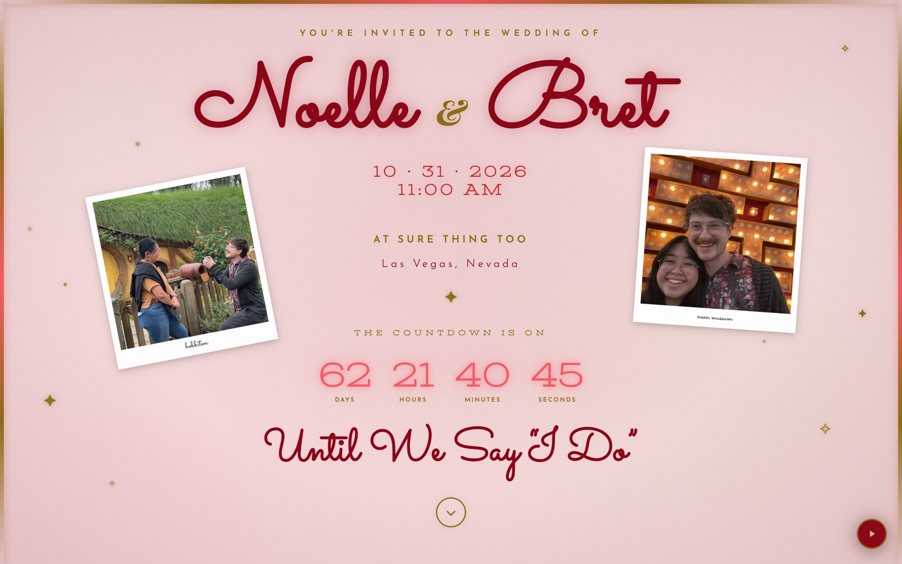
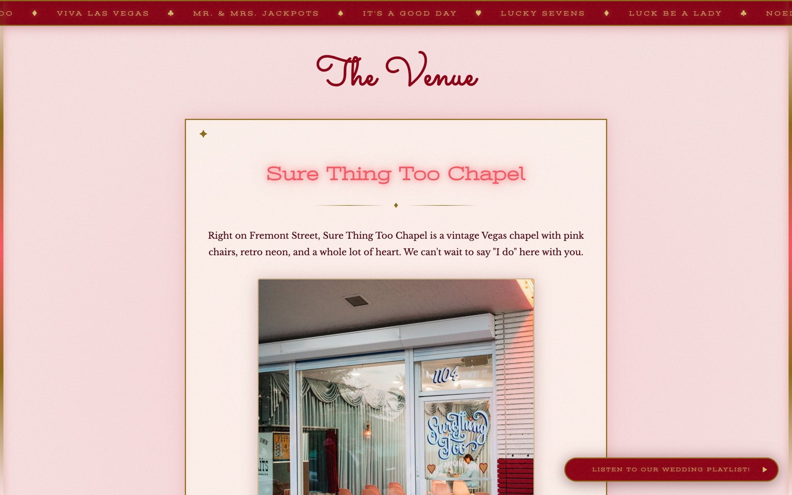
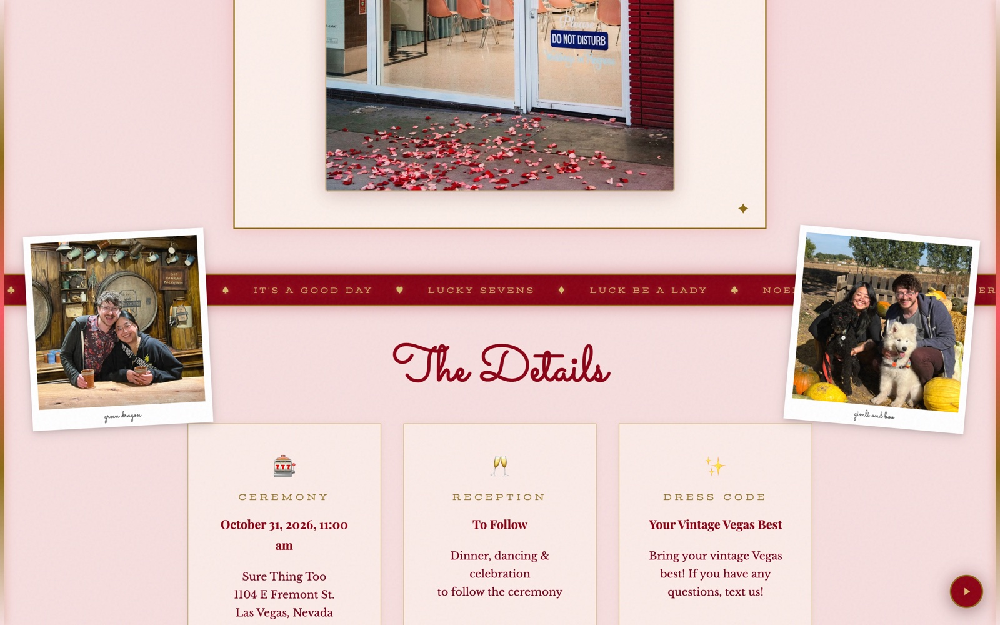
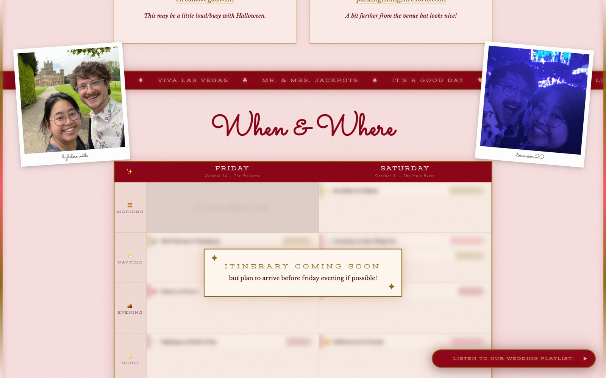
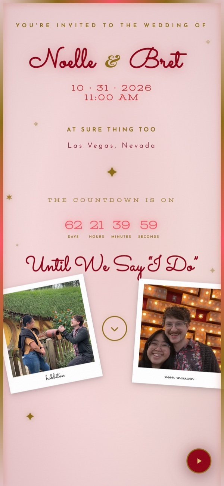

# Mr. & Mrs. Jackpots - a Vegas wedding site with a jukebox

> Our wedding invitation site, built in React with neon headings, scroll animations, a countdown, and polaroid photos. A floating jukebox plays our playlist and shows the current track and artist.

**Live site:** https://mr-and-mrs-jackpots.vercel.app

This repository describes the site. The source code is private.

  

---

## Overview

We're getting married at a vintage Vegas chapel on Halloween 2026. We wanted the invitation to use the same neon colors and retro type as the venue. I built it as a single React page, using CSS keyframes and hooks for the animations without a component or animation library.

## Screenshots

| The venue | The details |
|---|---|
|  |  |

| Hotel suggestions | When & where (itinerary) |
|---|---|
|  |  |

  

## Features

- **Hero** with neon-flicker script headings, a live countdown to the ceremony, and scattered polaroids with hand-written captions.
- **Scroll-reveal sections** (IntersectionObserver): the venue, ceremony/reception/dress-code details, hotel suggestions, and a two-day itinerary.
- **Card-suit marquees** that scroll between sections.
- **Jukebox:** A floating player for our wedding playlist, using the YouTube IFrame API. It shows the current title and artist and includes play, pause, and skip controls in a slide-in panel.
- **Admin mode:** A password-protected editor with drag-and-drop itinerary editing, so we can change the schedule without redeploying the site.
- Fully responsive down to phone widths.

## Technologies

React 19 · Vite · CSS-in-JS + keyframe animations · IntersectionObserver · YouTube IFrame Player API · Vercel

## Engineering notes

- CSS and React state control the neon flicker, marquee speed, photo positions, and countdown.
- The music player uses a state machine to handle YouTube API loading, autoplay restrictions, playback state, and track metadata.
- Photos are pre-sized and lazy-loaded to reduce load time on mobile.

## Status

Built March - April 2026 (40 commits). Live and in use by our guests.

## Development

We chose the design together, and I built the site.

---

*Bret Merritt · [GitHub](https://github.com/bretm9) · [LinkedIn](https://www.linkedin.com/in/bret-merritt) · merrittbret9@gmail.com*
